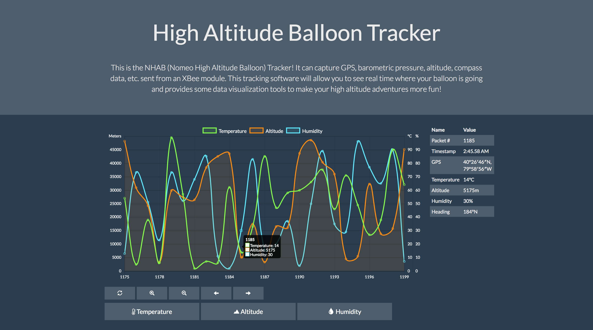

# Nomeo High Altitude Ballon


## Firmware

### Installing AVR Utilities

AVR utiltiies such as gcc and avrdude are needed to compile code and flash it to target device. To install, run command below:
```
sudo apt-get install gcc-avr binutils-avr gdb-avr avr-libc avrdude
```

### Building and Flashing Firmware

Once you have installed the AVR utilities (see [Installing AVR Utilities](#installing-avr-utilities)), you can build and flash
your board. The project is currently only tested on the ATMEGA2560.


To build firmware:
```
cd firmware
make
```

To flash firmware:
```
cd firmware
make flash
```

### Documentation

To view documentation for firmware:
```
cd firmware
make docs
```

Then open index.html in your favorite browser:
```
cd ../documentaiton/firmware
chromium-browser index.html &
```

## Web Tracker Application

<ul>
  <li> cd tracker </li>
  <li> npm install </li>
  <li> node server.js </li>
  <li> There are 2 options for connecting:
  <ul>
    <li> If running server on same device you would like to connect from, navigate to http://127.0.0.1:3000 </li>
    <li> If connecting to server from different device, replace 127.0.0.1 with the ip address of server (found using ifconfig) </li>
  </ul>
</ul>

Here's a screenshot of the app in action (note, currently no connection between firmware and web app, so data in image below is random):



